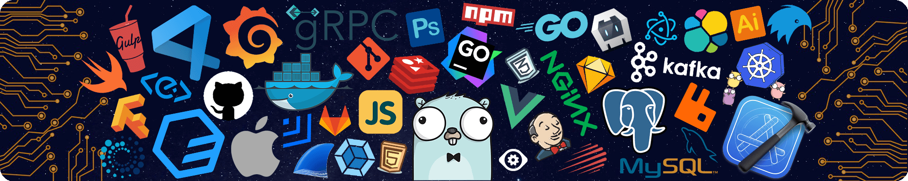

  

<!-- 动态打字效果 -->

  

<!--动态分割线-->

## 🥳 希望看到这的你，永不掉发！[个人主页]() | [博客站点]()

 

### 💻 关于
欢迎来到这里，感谢你的浏览，相关告知： 
 - 本页部分界面处于关闭状态&nbsp;&nbsp;&nbsp;&nbsp;&nbsp;&nbsp;  ~~原因看贪吃蛇🐍哈哈~~
 - 后续考虑分享自己开源代码和项目但还没有方向&nbsp;&nbsp;&nbsp;&nbsp;&nbsp;&nbsp;~~对没错，小趴菜🥦也有大梦想！！！~~
 - 希望能与大家一起交流，学习和进步。
 - 祝大家代码无bug
 - 哦对了祝大家永不掉发！永不掉发！用不掉发！

## 😎 ~~彭于晏~~是我
 - 🥦  一名C/C++小趴菜，目前在学习UE5中
 - 📚  爱折腾，爱钻研技术的~~彭于晏~~
 - ⏰  行动力拉满，想做的事绝不会拖沓！！！
 - 🧱  抗压值拉满，上压力上压力上压力！！！
 - 🐱‍🏍  足球，绘画建模，电子数码
 - 😜  熟人话痨，生人高冷
 - 🤬  需求，不要和我提需求
 
## 💼 技术栈

### ✍ 学习中

 

## 🚀

  

  

